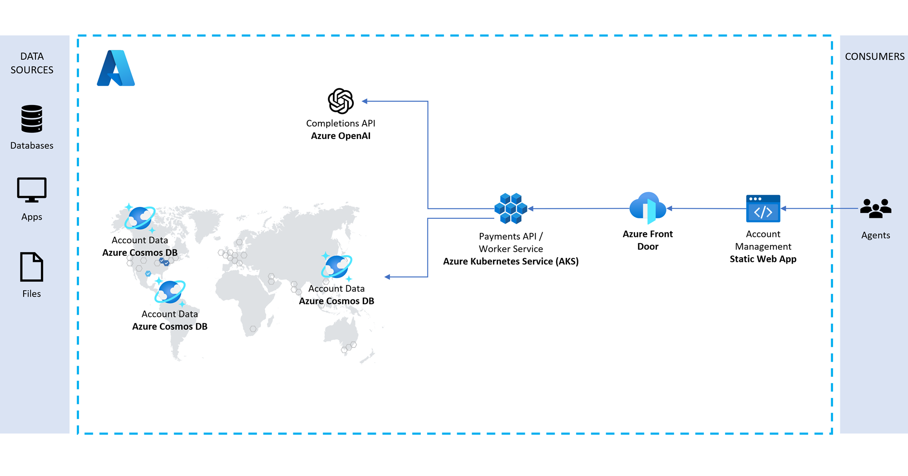

# Solution notes

## Architecture walkthrough



Once the solution is deployed, the architecture should look like the above diagram. The following is a brief description of the various components:

- All services are deployed across three regions to ensure high availability and to demonstrate Azure Cosmos DB replication and concurrency features.
- The front end is a React web application deployed to an Azure Static Web app. This is how users interact with the solution.
- The static web app sends all requests through Azure Front Door, which routes the requests to a Payments API instance, according to routing rules.
- The API is an ASP.NET Core API app that serves as a lightweight layer for the business logic that lives inside of a .NET 7 class library. It is containerized in Docker and deployed to an Azure Container App (ACA) or Azure Kubernetes Service (AKS).
- The background worker service is a Microsoft.NET.Sdk.Worker project that also references the .NET 7 class library and is deployed into a different Docker container within the same AKS service or a dedicated ACA instance.
- All data is stored in Azure Cosmos DB. The background worker service acts as the Azure Cosmos DB change feed processor, which executes as data within the monitored Cosmos DB containers are inserted or updated, allowing for the application of business rules and automated updating of data within various containers. For this architecture, a CQRS pattern is in place to allow independent scalability between writes (new transactions) and reads (balances or statement queries) and Azure Cosmos DB change feed is the key to replicate data between containers.
- There is an Azure OpenAI deployment that provides a completion model, orchestrated by Semantic Kernel. This enables users to ask questions about transactions in an account.


## Running the solution locally

Before you can successfully run the solution locally, you need to do the following:

1. Start Docker Desktop
2. Configure RBAC for Cosmos DB
    1. Assign yourself to the "Cosmos DB Built-in Data Contributor" role:

        ```cli
        az cosmosdb sql role assignment create --account-name YOUR_COSMOS_DB_ACCOUNT_NAME --resource-group YOUR_RESOURCE_GROUP_NAME --scope "/" --principal-id YOUR_AZURE_AD_PRINCIPAL_ID --role-definition-id 00000000-0000-0000-0000-000000000002
        ```

3. Make sure you're signed in to Azure from Visual Studio before running the backend applications locally.
